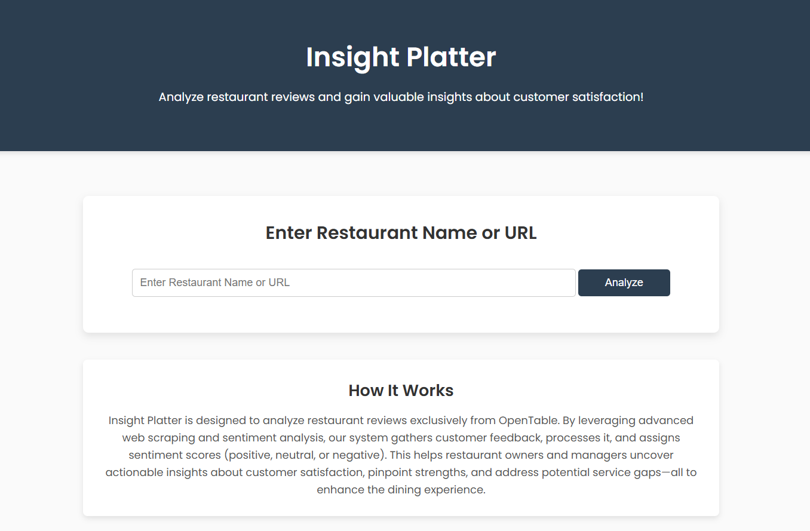
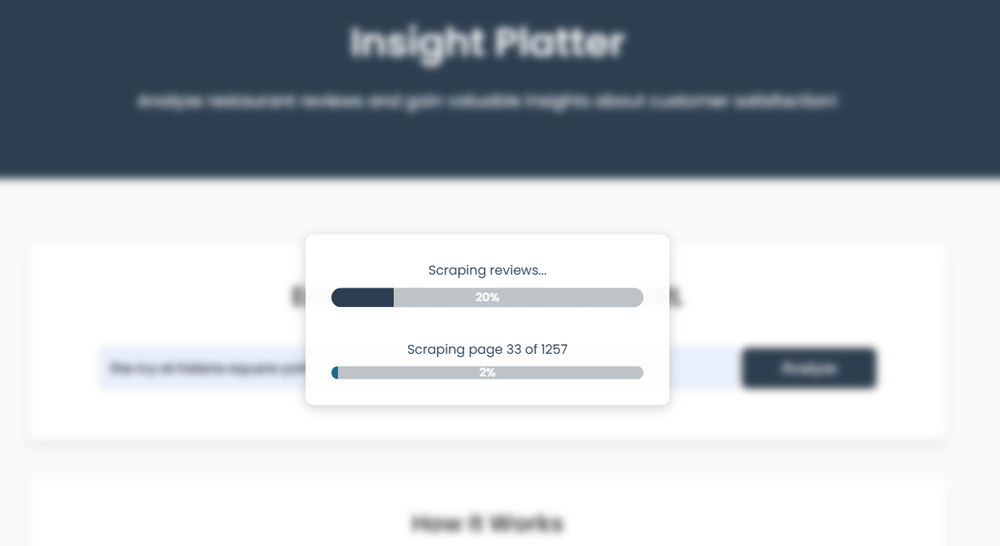
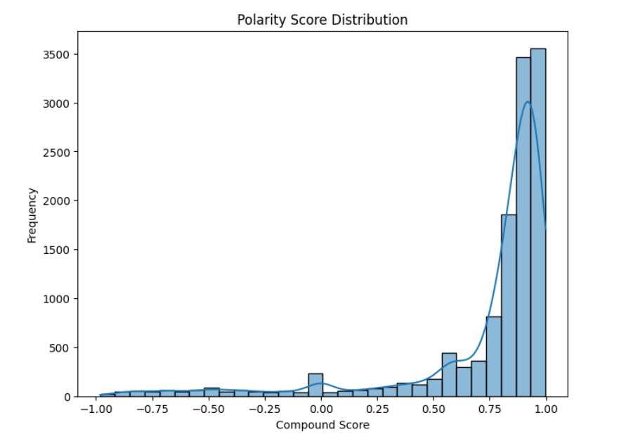
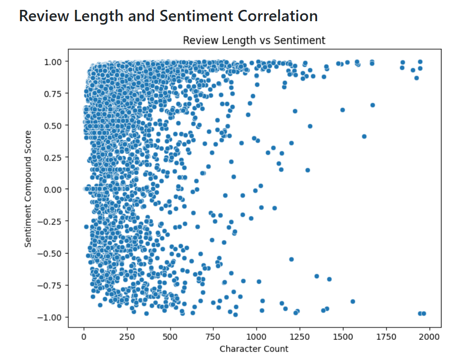
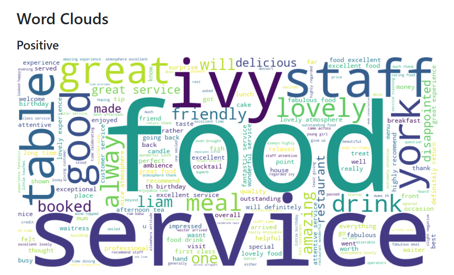
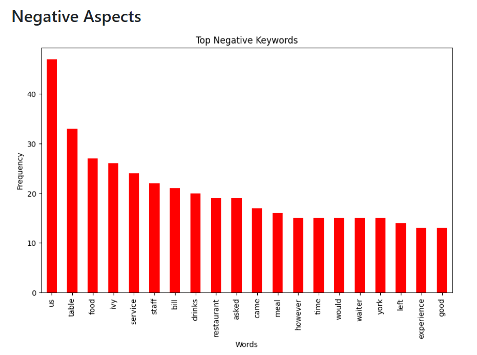
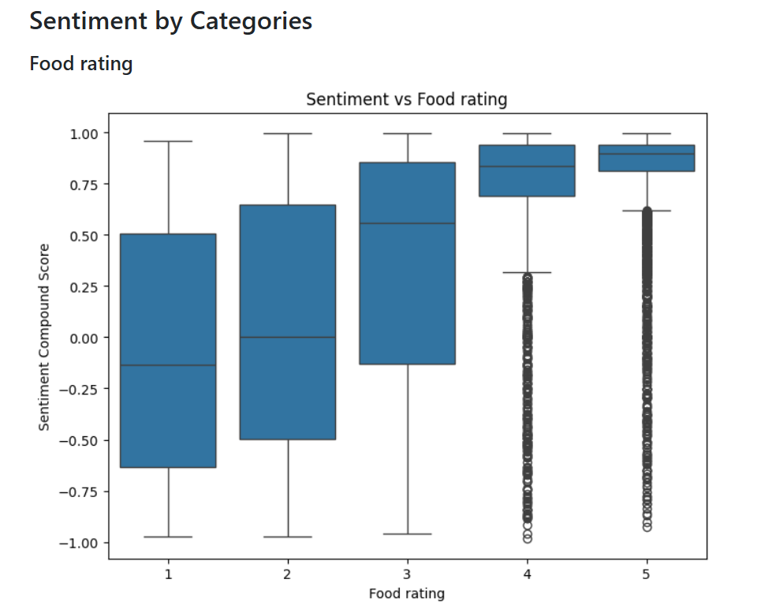
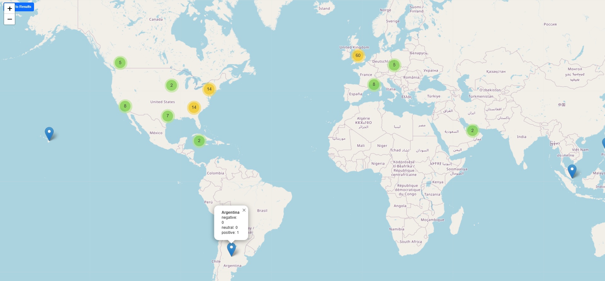

# <h1 align="center">Insight Platter: Restaurant Sentiment Analysis</h1>

**Analyze restaurant reviews from OpenTable to provide sentiment scores and valuable insights into customer opinions.**

 

---

## Project Description

**Insight Platter** is a tool designed to analyze customer reviews from **OpenTable**. It performs sentiment analysis to evaluate customer opinions and feedback. By understanding customer sentiments, businesses can enhance their services and elevate customer satisfaction. This project offers actionable insights into customer behavior, enabling restaurants to make data-driven decisions.

---

## Table of Contents
- [Project Title and Overview](#project-title-and-overview)
- [Project Description](#project-description)
- [Features](#features)
- [Technology Stack](#technology-stack)
- [Demo](#demo)
- [Installation](#installation)
- [Usage](#usage)
- [Configuration](#configuration)
- [Testing](#testing)
- [License](#license)
- [FAQs](#faqs)
- [Contact Information](#contact-information)

---

## Features

- Scrape and process restaurant reviews from OpenTable.
- Perform sentiment analysis to determine customer opinions.
- Display sentiment scores and insights on an interactive dashboard.
- Provide visualizations for easy interpretation of customer feedback.
- User-friendly interface for scraping reviews and viewing results.
- Utilizes a custom-built machine learning model for dynamic analysis based on dataset characteristics.
- Real-time communication enabled through WebSockets for seamless updates.

---

## Technology Stack

**Frontend**:
- HTML5, CSS3, JavaScript
- Bootstrap for responsive design

**Backend**:
- Python, Flask (for web server)
- BeautifulSoup (for web scraping)
- NLTK (Natural Language Toolkit for sentiment analysis)
- Pandas, NumPy (for data manipulation)

**Machine Learning:**:
- Custom-built model for sentiment analysis, dynamically selecting algorithms based on dataset characteristics.
    - Uses Logistic Regression, Decision Trees, Random Forest, or Gradient Boosting depending on dataset size and class distribution.
    - Incorporates SMOTE for handling class imbalances.

**Other Tools**:
- Plotly (for visualizations)

---

## Demo

Below are snapshots of the application showcasing its functionality:

- **Home Page**: Interactive interface to input restaurant URLs and view results.
- **Sentiment Dashboard**: Visual breakdown of customer opinions.










Explore the platform to dive deeper into more detailed charts and comprehensive insights!

---

## Installation

To set up the project locally, follow these steps:

1. Clone the repository:
    ```bash
    git clone https://github.com/ThakkarVidhi/restaurant-review-analysis.git
    cd restaurant-review-analysis
    ```

2. Install the required dependencies:
    ```bash
    pip install -r requirements.txt
    ```

3. Run the Flask application:
    ```bash
    python app.py
    ```

4. Access the application at `http://127.0.0.1:5000/` in your browser.

---

## Usage

1. Enter the OpenTable restaurant URL in the provided input field.
2. Click on the Analyze button to start scraping and analyzing reviews.
3. View the sentiment analysis results and visualizations on the dashboard.
4. real-time updates are displayed through WebSockets as the analysis progresses.

---

## Configuration

The application uses a `config.py` file for managing essential settings. Below is the list of configuration variables and their purposes:


1. **`BASE_DIR`**  
   Defines the base directory of the project, used as a reference for other directory paths.

2. **`SCRAPPING_BASE_URL`**  
   The base URL used for scraping restaurant reviews from OpenTable.

3. **`MODEL_PATH`**  
   Specifies the file path to the machine learning model, which includes SMOTE preprocessing and the sentiment analysis pipeline.

4. **`CHROME_DRIVER_PATH`**  
   Points to the ChromeDriver executable required for web scraping functionalities. Ensure this is configured correctly based on your system.

5. **`DATA_DIR`**  
   Root directory for storing data-related files such as raw, processed, and dashboard data.

6. **`RAW_DATA_DIR`**  
   Directory for storing raw data scraped from OpenTable.

7. **`ANALYSIS_DATA_DIR`**  
   Directory for storing cleaned and processed data used for analysis.

8. **`DASHBOARD_DATA_DIR`**  
   Directory for storing data visualized on the dashboard.

9. **`TEMPLATE_DIR`**  
   Directory containing HTML templates for rendering the frontend of the application.

10. **`STATIC_DIR`**  
    Directory containing static assets such as CSS, JavaScript, and image files.

11. **`DEBUG`**  
    Boolean flag to enable or disable debugging mode for the Flask application.

---

## Testing

This project includes basic manual testing. To test the application:

1. Run the Flask server.
2. Input various OpenTable restaurant URLs and verify the results.
3. Check logs for any scraping or analysis errors.

---

## License

This project is licensed under the [MIT License](LICENSE).  


---

## FAQs

**Q: What data sources are supported?**  
**A:** Currently, the application only supports scraping reviews from OpenTable restaurant URLs.

**Q: How do I troubleshoot scraping errors?**  
**A:** Ensure that the provided URL is valid and corresponds to an OpenTable restaurant page. Check the logs for detailed error messages.

**Q: How are sentiment scores calculated?**  
**A:** The application uses a custom-built machine learning pipeline that dynamically selects models and preprocessing techniques based on dataset characteristics.

**Q: How does the application handle real-time updates?**  
**A:** The application uses Flask-SocketIO to provide real-time communication between the server and the client, ensuring seamless updates during analysis.

---

## Contact Information

For questions or feedback, feel free to reach out:

- **Email**: [vidhithakkar.ca@gmail.com](mailto:vidhithakkar.ca@gmail.com)
- **LinkedIn**: [Vidhi Thakkar](https://www.linkedin.com/in/vidhi-thakkar-0b509724a/)